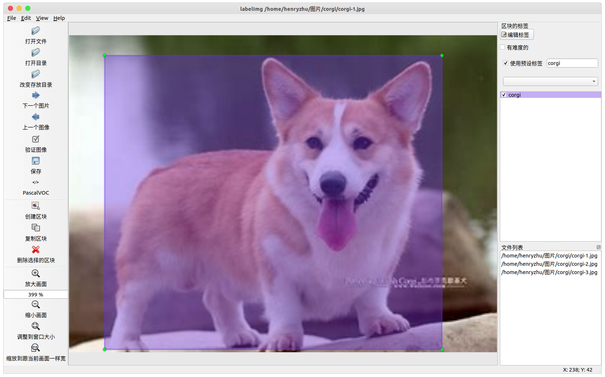

# 基于目标识别任务的数据集制作

- [x] [数据集的制作](#数据集的制作)
- [x] [图像标注](#图像标注)
- [ ] [转换至可训练的标准数据集](#转换至可训练的标准数据集)
  - [x] [转换成 VOC 格式](#转换成-VOC-格式)
  - [x] [转换成用于 YOLOv5 的 COCO 格式](#转换成用于-YOLOv5-的-COCO-格式)
- [ ] [开源数据集下载](#开源数据集下载)

- [基于目标识别任务的数据集制作](#基于目标识别任务的数据集制作)
- [Notes](#notes)
- [数据集的制作](#数据集的制作)
  - [目录管理](#目录管理)
  - [基于视频的数据处理](#基于视频的数据处理)
    - [视频录制与文件归档](#视频录制与文件归档)
    - [matlab中处理视频文件](#matlab中处理视频文件)
    - [matlab数据文件转label标注文件](#matlab数据文件转label标注文件)
  - [基于单张图片的数据处理](#基于单张图片的数据处理)
    - [收集数据集](#收集数据集)
    - [数据集预处理](#数据集预处理)
    - [格式化文件名与标注](#格式化文件名与标注)
    - [图像标注](#图像标注)
      - [labelImg](#labelimg)
      - [labelImg 安装](#labelimg-安装)
      - [labelImg 使用](#labelimg-使用)
      - [labelImg 快捷键](#labelimg-快捷键)
- [转换至可训练的标准数据集](#转换至可训练的标准数据集)
  - [转换成 VOC 格式](#转换成-voc-格式)
  - [转换成用于 YOLOv5 的 COCO 格式](#转换成用于-yolov5-的-coco-格式)

最新的版本可以下载
```bash
git clone https://gitee.com/whu-esdc/object-detection/tree/master/dataset-app
```

# Notes
> 需要说明的是，该版本可以针对按照标注进行分类的数据进行处理，如果一张图片有多个标注，是无法处理的

# 数据集的制作
## 目录管理
> 首先要明确的是，该项目仅仅是脚本库，不包括数据集

目录如下，建议将该项目放于和需要处理的数据集处于相同目录下
```bash
.
├─dataset-app # 处理数据集的脚本
├─dataset-A   # 数据集A
├─dataset-B   # 数据集B
└─...         # 其他数据集
```
需要处理其他数据集或者数据集在其他目录下，只需要在`config/config.yaml`中将`dataset`修改成对应目录即可
```bash
dataset: ../dataset-A
```

## 基于视频的数据处理
### 视频录制与文件归档
### matlab中处理视频文件
### matlab数据文件转label标注文件
运行脚本 `scripts/read_label_from_mat.py`，将视频目录下全部的`.label`文件转换成`labelImg`格式的`.jpg`、`.xml`文件
```bash
python3 scripts/read_label_from_mat.py
```
> 运行的时候会看到视频标注的过程，如果使用的时没有界面的服务器端，需要自行修改代码

至此，就完成了视频文件的标注，接下来需要进行[转换至可训练的标准数据集](#转换至可训练的标准数据集)
## 基于单张图片的数据处理
### 收集数据集
这一步，我们需要根据任务需求搜集对应的数据集，并放置在 ``dataset-A/src`` 目录下面，并且按照类别防止到对应文件夹下

```bash
·
├── dataset-app     # 处理数据集的脚本
├── dataset-A # 数据集文件夹
  ├── src         # 原始图片文件，按照文件夹分类
  │ ├─ A        # 类别 A
  │ ├─ B
  │ └─ ...
  ├─ labeled     # 压缩、重命名后的文件，在这里进行标注
  │ ├─ A
  │ ├─ B
  │ └─ ...
  ├─ VOC2012     # VOC 标准数据集，用于训练
  └─ COCO        # COCO 标准数据集，用于训练
```
可以看到，目录的命名规则如上

### 数据集预处理
数据集需要进行压缩和降采样预处理
- 数据集的图片的大小不能太大，需要预先压缩至目标size 。否则，整个完整的数据集大小会达到 `GB` 级以上，预处理的脚本在 ``scripts/rename.py`` 中


### 格式化文件名与标注
执行重命名脚本。
```bash
python ./scripts/rename.py
```
目录内全部文件会**按照目录名**进行重命名并且压缩数据集，并且在 `src` 同级目录下产生 `labeled` ，在这里进行标注


- **重命名之后进行图像标注**，图像标注的过程详见 [labelImg 的使用](#图像标注)
- 执行完之后进行可以进行[数据集转换](#转换至可训练的标准数据集)


### 图像标注
#### labelImg
<!-- https://blog.csdn.net/Dontla/article/details/102662815 -->

LabelImg 是图形图像注释工具。它是用 Python 编写的，并将 Qt 用于其图形界面。

批注以 **PASCAL VOC** 格式（ImageNet 使用的格式）另存为 `.xml` 文件。此外，它还支持 YOLO 格式

#### labelImg 安装
- Github 上的 [labelImg 源码](https://github.com/tzutalin/labelImg) 编译 (Python 3+pyQt5)

```bash
sudo apt-get install pyqt5-dev-tools
sudo pip3 install -r requirements/requirements-linux-python3.txt
make qt5py3

# start
python3 labelImg.py
python3 labelImg.py [IMAGE_PATH] [PRE-DEFINED CLASS FILE]
```
- pip安装 (推荐)
```bash
pip install labelImg

# start
labelImg
```
#### labelImg 使用
在 Ubuntu 下启动后的界面如下（Windows 版本可能略有差异）


<!--  -->

- 打开文件 : 标注单张图像（不推荐使用）
- **打开目录** : 打开数据集存放的目录，目录下应该是图像的位置
- **改变存放目录**: 标注文件 `.xml` 存放的目录
- 下一个图片: 
- 上一个图像: 
- **验证图像**: 验证标记无误，用于全部数据集标记完成后的检查工作
- **保存**: 保存标记结果，快捷键 `Ctrl+s`
- **数据集格式**: `PascalVOC` 和 `YOLO` 可选，一般选择 `PascalVOC` 即可，需要 `YOLO` 可以之后进行转换

点击 `创建区块` 创建一个 矩形框，画出范围


每个类别都有对应的颜色加以区分


完成一张图片的标注后，点击 `下一个图片`

#### labelImg 快捷键

| 快捷键 |           功能           | 快捷键 |       功能       |
| :----: | :----------------------: | :----: | :--------------: |
| Ctrl+u |    从目录加载所有图像    |   w    |  创建一个矩形框  |
| Ctrl+R |   更改默认注释目标目录   |   d    |    下一张图片    |
| Ctrl+s |     保存当前标注结果     |   a    |    上一张图片    |
| Ctrl+d |   复制当前标签和矩形框   |  del   | 删除选定的矩形框 |
| space  |  将当前图像标记为已验证  | Ctrl+  |       放大       |
|  ↑→↓←  | 键盘箭头移动选定的矩形框 | Ctrl–  |       缩小       |


# 转换至可训练的标准数据集
- [x] [转换成 VOC 格式](#转换成-VOC-格式)
- [x] [转换成用于 YOLOv5 的 COCO 格式](#转换成用于-YOLOv5-的-COCO-格式)
## 转换成 VOC 格式
制作过程由脚本自动完成

<!-- **VOC2012** 数据集描述：
- **Annotations**: 存放了数据`xml`格式存储的标签，里面包含了每张图片的`bounding box`信息，主要用于**目标检测**。
- **ImageSets**: ImageSets中的Segmentation目录下存放了用于分割的train, val, trainval数据集的索引。
- **JPEGImages**: 这里存放的就是JPG格式的原图，包含17125张彩色图片，但只有一部分(2913张)是用于分割的。
- **SegmentationClass**: 语义分割任务中用到的label图片，PNG格式，共2913张，与原图的每一张图片相对应。
- **SegmentationObject**: 实例分割任务用到的label图片，在语义分割中用不到，这里不详解介绍。
--- -->


- 生成VOC格式的数据集空目录。在当前目录下，执行
```bash
python3 ./scripts/labeled-to-voc.py
```
- 生成类别文件 `classes.names` 和训练集文件 `train.txt` 、数据集文件 `val.txt`


## 转换成用于 YOLOv5 的 COCO 格式
```bash
python3 ./scripts/labeled-to-voc.py
python3 ./scripts/labeled-to-coco.py
```
